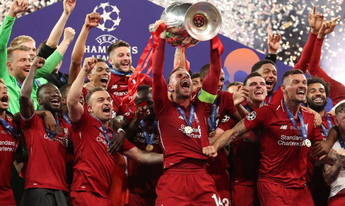

- [자기소개](#자기소개)

안녕하세요. SSAFY 14기 부울경 캠퍼스 2반 정승현 입니다.

***열심히 공부하는 모습을 기록하도록 하겠습니다.***

- [7월 16일 학습자료](https://www.notion.so/7-7-16-23296aba58cc80409e87c0acc83a34d8)
- [7월 17일 학습자료](https://www.notion.so/8-7-17-23296aba58cc8083a2c8cb67ca47f9c4)

## 취미


제 취미는 **축구** 입니다.

제가 좋아하는 축구 팀은 ~~첼시~~ 가 아니라 ***리버풀*** 입니다.
- [리버풀 공식 홈페이지](https://www.bing.com/search?pglt=2083&q=liverpool&cvid=c7f384052df94d07bd59583857e047e5&gs_lcrp=EgRlZGdlKgYIABBFGDkyBggAEEUYOTIGCAEQABhAMgYIAhAAGEAyBggDEAAYQDIGCAQQABhAMgYIBRAAGEAyBggGEAAYQDIGCAcQABhAMgYICBBFGDzSAQgzMjg4ajBqMagCALACAA&FORM=ANNTA1&adppc=EDGEESS&PC=U531)



제가 좋아하는 ***선수*** 들을 포지션 별로 소개합니다.

1.  공격수
       - 디오구 조타
       - 모하메드 살라
       - 코디 각포
       - 다르윈 누녜스

2. 미드필더
   - 비르츠
   - 소보슬라이
   - 하비 엘리엇
   - 흐라벤베르흐
   - 맥 알리스터

3. 수비수
   -  반다이크
   -  코나테
   -  케르케즈
   -  프림퐁

4. 골키퍼
   - 알리송 베케르

---

### 이 중 방출해야 한다고 생각하는 선수를 소개합니다.

- [ ] 코나테 -> ~~반다이크의 영원한 파트너로 남아줬으면 좋겠다.~~
- [x] 다르윈 누녜스 -> *의리는 있지만 골 결정력이 너무 아쉬움* 
- [x] 루이스 디아즈 -> **의리가 없음. 본인도 이적을 희망함**
- [x] 하이 엘리엇 -> ***벨링엄, 비르츠만큼의 임팩트를 보여주지 못하는중***

### Liverpool 선수들의 24/25시즌 성적을 공개합니다.

```python
liverpool_stats = {
    "모하메드 살라": {"골": 15, "어시스트": 8},
    "다윈 누녜스": {"골": 10, "어시스트": 6},
    "루이스 디아스": {"골": 7, "어시스트": 5},
    "도미닉 소보슬라이": {"골": 5, "어시스트": 7},
    "코디 각포": {"골": 6, "어시스트": 4},
}

# 출력
print("리버풀 2024/25 시즌 선수별 골/어시스트 기록\n")
for player, stats in liverpool_stats.items():
    print(f"{player}: 골 {stats['골']} / 어시스트 {stats['어시스트']}")
```
#### 끝으로 제가 가장 좋아하는 선수를 소개하고 마치겠습니다.

- [x] 알리송 베케르 **!! 축하합니다.**


**세계 최고 미남 골키퍼**

***이상입니다. 감사합니다.***